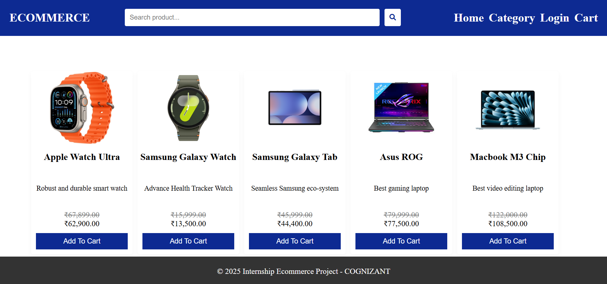
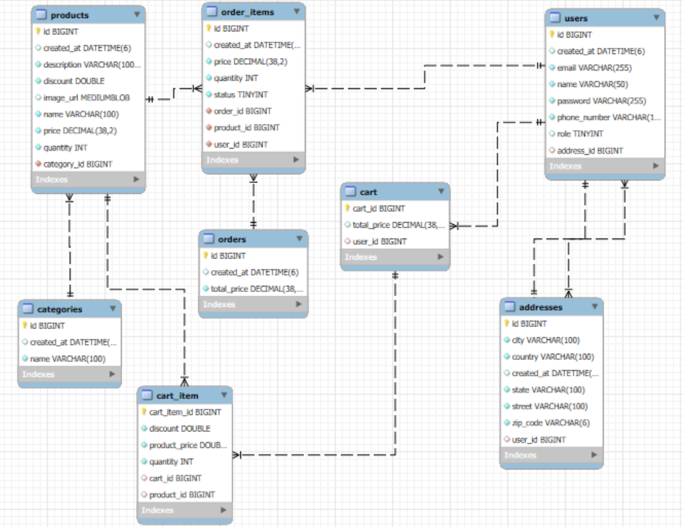

# E-Commerce Platform

## Introduction
This project is an E-Commerce Platform that allows users to browse products, manage shopping carts and track orders. It includes an admin interface to manage products, orders, users, and analytics. The backend supports Java (Spring Boot) frameworks and for database purpose, MySQL is used.

## Features
### Product Management
- Create, update, delete and categorize products.
- Display product details including name, description, price, quantity and image.

### Shopping Cart
- Add/remove products to/from the shopping cart.
- View items and total price.

### Order Management
- Place orders with shipping details.
- Track order status (pending, confirmed, shipped, delivered, cancelled, returned).

### User Authentication and Profile Management
- User registration and login.
- Profile updates (name, address, orders).

### Admin Dashboard
- Manage products, view order statuses, and customer details.

## Architecture
- **Frontend**: Angular 19
- **Backend**: REST API based Spring Boot
- **Database**: MySQL

## Database Design
### Product Management Module
- **Entities**: Product (ProductID, Name, Description, Price, Category, ImageURL)

### Shopping Cart Module
- **Entities**: CartItem (CartItemID, ProductID, Quantity, TotalPrice)

### Order Management Module
- **Entities**: Order (OrderID, UserID, TotalPrice, ShippingAddress, OrderStatus, PaymentStatus)

### User Authentication and Profile Management Module
- **Entities**: User (UserID, Name, Email, Password, ShippingAddress)

### Admin Dashboard Module
- **Entities**: Admin (AdminID, Name, Role, Permissions)

## Deployment
- **Frontend**: Served using local servers.
- **Backend**: Deployed locally using Spring Boot.
- **Database**: Local instance of the MySQL database.

## User Interface Design
- Product Listing Page
- Shopping Cart Page
- Order Confirmation Page
- User Profile Management Page
- Admin Dashboard

## Non-Functional Features
- The platform should handle up to 1000 concurrent users.
- The system is designed to scale vertically and horizontally as demand increases.
- Implemented secure authentication, authorization, and encryption protocols.
- The user interface must be responsive, intuitive, and accessible across devices.

## API Endpoints

### Authentication
| Endpoint               | Method | Description                    |
|------------------------|--------|--------------------------------|
| `/auth/register`       | POST   | Register a new user            |
| `/auth/login`          | POST   | Login a user                   |
| `/user/my-info`        | GET    | Get logged-in user information |
| `/user/get-all`        | GET    | Get all users                  |

### Products
| Endpoint                         | Method | Description                    |
|----------------------------------|--------|--------------------------------|
| `/product/create`                | POST   | Add a new product              |
| `/product/update`                | PUT    | Update an existing product     |
| `/product/get-all`               | GET    | Get all products               |
| `/product/search`                | GET    | Search products                |
| `/product/get-by-category-id/{categoryId}` | GET    | Get products by category ID    |
| `/product/get-by-product-id/{productId}`   | GET    | Get product by ID              |
| `/product/delete/{productId}`    | DELETE | Delete a product               |

### Categories
| Endpoint                         | Method | Description                    |
|----------------------------------|--------|--------------------------------|
| `/category/create`               | POST   | Create a new category          |
| `/category/get-all`              | GET    | Get all categories             |
| `/category/get-category-by-id/{categoryId}` | GET    | Get category by ID             |
| `/category/update/{categoryId}`  | PUT    | Update a category              |
| `/category/delete/{categoryId}`  | DELETE | Delete a category              |

### Orders
| Endpoint                         | Method | Description                    |
|----------------------------------|--------|--------------------------------|
| `/order/create`                  | POST   | Create a new order             |
| `/order/filter`                  | GET    | Get all orders                 |
| `/order/filter`                  | GET    | Get order item by ID           |
| `/order/filter`                  | GET    | Get all order items by status  |
| `/order/update-item-status/{orderItemId}` | PUT    | Update order item status       |

### Addresses
| Endpoint                         | Method | Description                    |
|----------------------------------|--------|--------------------------------|
| `/address/save`                  | POST   | Save an address                |
| `/address/user/{userId}`         | GET    | Get address by user ID         |

### Cart
| Endpoint                         | Method | Description                    |
|----------------------------------|--------|--------------------------------|
| `/cart/add`                      | POST   | Add to cart                    |
| `/cart/update/add/{cartItemId}/{productId}` | PUT    | Update cart item by quantity   |
| `/cart/update/remove/{cartItemId}/{productId}` | PUT    | Remove cart item by quantity   |
| `/cart/delete/{cartItemId}`      | DELETE | Remove cart item               |
| `/cart/user/{userId}`            | GET    | Get cart by user               |
| `/cart/search`                   | GET    | Search cart items by product name |

## Running Project
- **Frontend**: `ng serve` from Angular-CLI.
- **Backend**: Run as Spring Boot Application.
- **Database**: Create `application.properties` file then create the same schema in MySQL.